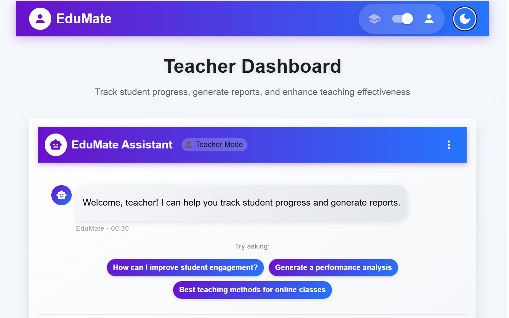
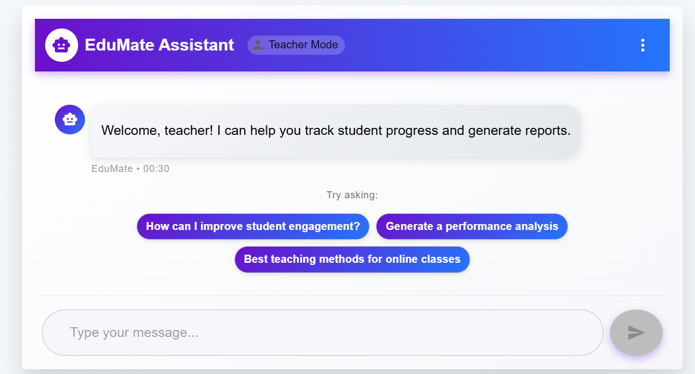
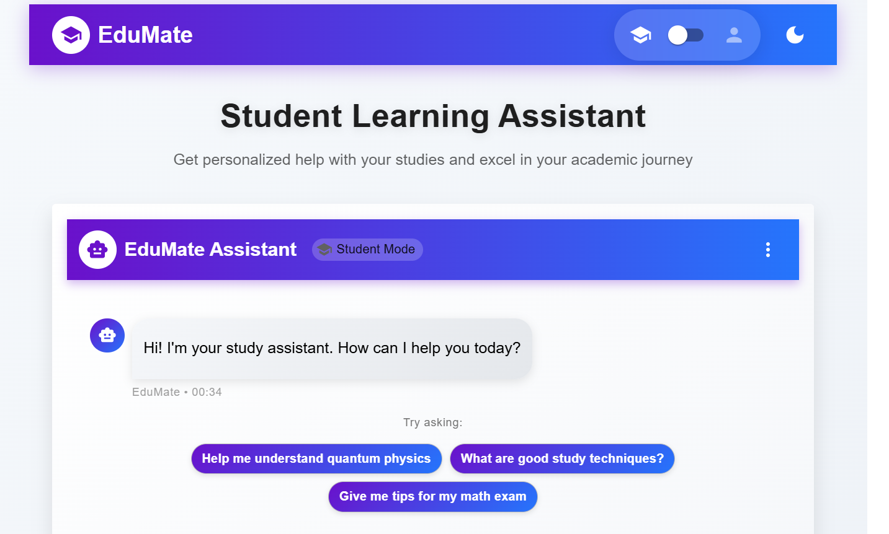
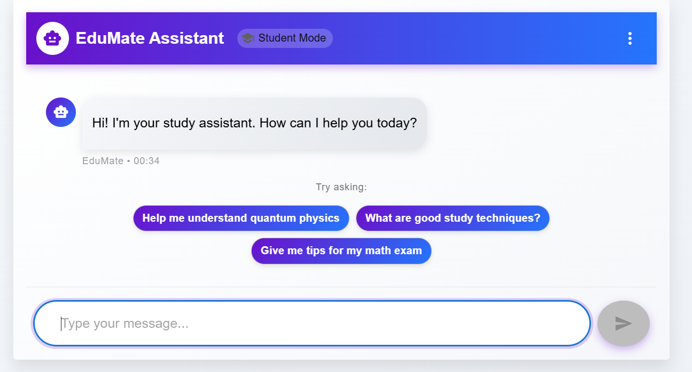

# 🧠 AI-Powered E-Learning Platform

A full-stack web application built to enhance online education with AI-driven learning support for students and intelligent progress tracking tools for teachers.

## 🏆 Hackathon Recognition

🏅 **3rd Place Winner** – National-Level Hackathon  
Recognized for innovation and real-world application in the EdTech domain.

---

## 🚀 Features

### 👩‍🎓 Student Dashboard

- 🤖 AI chatbot for study sessions and quiz preparation
- 📚 Personalized learning assistance
- 📈 View individual learning progress

### 👨‍🏫 Teacher Dashboard

- 🧑‍🎓 Monitor student performance
- 📝 Auto-generate progress reports
- 📤 Email reports to students directly
- 📅 Plan lecture content with AI support

### ✨ Universal Features

- 🔒 Role-based authentication (JWT)
- 💬 Responsive chat interface with OpenAI GPT integration
- 📱 Mobile-friendly UI using Tailwind CSS

---

## 🛠️ Tech Stack

| Frontend     | Backend          | Database | Other Integrations   |
| ------------ | ---------------- | -------- | -------------------- |
| React.js     | Node.js, Express | MongoDB  | OpenAI API, SendGrid |
| Tailwind CSS | JWT Auth         |          |                      |

---

## 🧪 Setup Instructions

1. **Clone the repository**

   ```bash
   git clone https://github.com/your-username/elearning-platform.git
   cd elearning-platform
   ```

2. **Install dependencies**

   ```bash
   npm install
   ```

3. **Set up environment variables**
   Create a `.env` file in the root with:

   ```env
   GEMINI_API_KEY=your-gemini-api-key
   ```

4. **Start the app**
   ```bash
   npm run dev
   ```

---

## 📷 Screenshots






---

## 🤝 Contributions

Pull requests and suggestions are welcome. For major changes, please open an issue first to discuss what you'd like to change.
